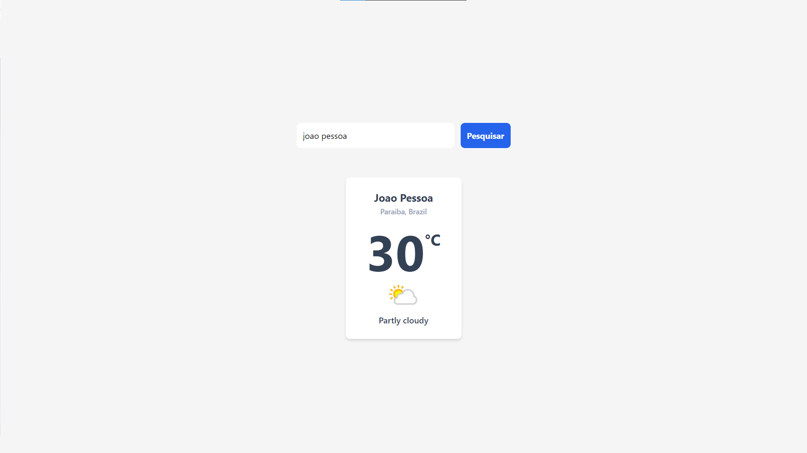

<h1 align="center"> Previsão do tempo </h1>

App de previsão do tempo criada utilizando React JS, React Hook, Tailwind CSS, com base nos ensinamentos do [vídeo - React JS: Criando um app usando react hooks, tailwind css e consumindo API externa](https://youtu.be/O6fYg3-Kgx0) do canal [@ManualdoDev](https://www.youtube.com/@ManualdoDev) no Youtube. 

  <a href="#-tecnologias">🚀 Tecnologias</a>&nbsp;&nbsp;&nbsp;|&nbsp;&nbsp;&nbsp;
  <a href="#-projeto">💻 Projeto</a>&nbsp;&nbsp;&nbsp;|&nbsp;&nbsp;&nbsp;
  <a href="#-layout">🔖 Layout</a>&nbsp;&nbsp;&nbsp;|&nbsp;&nbsp;&nbsp;
  <a href="#memo-licença">:memo: Licença</a>

 

  

## 🚀 Tecnologias

Esse projeto foi desenvolvido com as seguintes tecnologias:

 

## 💻 Projeto

O projeto é um App de Clima usando React JS, React Hook, Tailwind CSS e consumindo uma API externa. Nesse App, além do React JS, também foi usado alguns conceitos importantes, como o ESLint, funções assíncronas, eventos sintéticos, Hooks, estilização e design responsivo usando Tailwind CSS.

## 🔖 Layout

Você pode navegar pelo projeto através [DESSE LINK](https://thiagomonts.github.io/).

## :memo: Licença

Esse projeto está sob a licença MIT.

---

Desenvolvido por [Thiago Honorato](https://www.linkedin.com/in/honoratothiago/)
